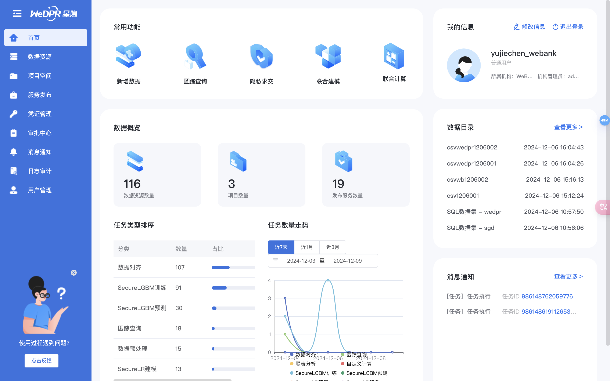

# 1. WeDPR产品概述

标签: ``产品概述`` ``操作指南``

----

本章对WeDPR隐私计算平台的重要功能的使用方法和限制进行详细介绍。 当用户在某个功能模块遇到问题时，可以在用户指南对应的模块章节中寻求解决方法。下面对各模块指南的主要内容进行介绍。

**主界面预览**
******

**数据资源管理**
******
数据资源是隐私计算任务的核心：
- 数据资源管理模块提供了数据资源查询、上传、共享、授权、修改、删除等功能
- 支持多种异构数据资源的接入，包括但不限于HDFS、Hive、SQL(包括国产数据库)等

**项目空间**
******
项目空间是任务的管理单元，用户必须在指定的项目中才可发起隐私计算任务。
- 提供了项目创建、查询、修改、删除等功能
- 项目空间内可发起隐私求交集、匿踪查询、联合分析和联合建模等类型的任务
- 通过项目空间可跳转到专家模式交互界面，通过专家模式内置的wedpr-ml-toolkit发起隐私计算任务

**服务发布**
******
WeDPR支持将数据集发布为PIR服务，将模型发布为预测服务。 服务发布模块提供了服务发布、查询、更新、删除、申请和授权功能。

**凭证管理**
******
类似于云托管平台，WeDPR也实现了一套API认证机制，并在Web页面中提供了凭证管理功能。用户可通过Web页面创建AccessKey，并使用AccessKey生成API Signature， 以API的方式访问WeDPR管理台的所有接口，并访问该AccessKey所属用户的所有数据资源、服务资源和任务信息。
凭证管理模块功能包括：
- 创建AccessKey
- 启用/禁用/复制AccessKey
- 查询AccessKey

**审批中心**
******
WeDPR的所有资源(数据、服务、项目)的权限均是用户维度的，某用户若需使用其他用户的数据、服务，须走审批流申请授权，审批中心提供了如下功能：

- 创建、查询、修改审批单(包括审批链)
- 审批单授权功能，跟踪各个审批单的整个审批链
- 审批完成后，触发审批单对应的事件，完成数据资源、服务资源等的授权操作
- 支持审批驳回和撤销审批单

**消息通知**
******
由于隐私计算任务涉及到多个参与方，当某用户使用其他用户的数据集D发起隐私计算任务时，该任务的元信息会同步到数据集D所在机构，数据集D的属主可在消息通知模块获取任务执行情况。
消息通知模块可使得数据集属主清晰地知道其数据集的使用情况，防止授权后的数据滥用。

**日志审计**
******
在满足用户意愿的前提下(如发布数据集时，用户可以选择是否将数据集元信息同步给其他机构)，WeDPR通过区块链完成系统关键可公开的元数据信息同步，日志审计模块记录了每个上链元数据的链上存证，使得每个操作在链上均可追溯，提升了隐私计算平台的公信力。

**用户管理**
******
WeDPR隐私计算平台支持多用户模式，一个机构可注册若干用户来使用该平台。用户管理模块采用用户组的模式管理系统所有用户，支持用户组的创建、删除、查询；用户组管理员的添加、移除；用户的添加、移除等功能。
