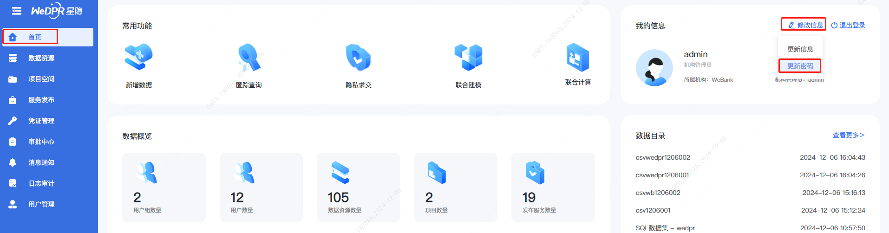
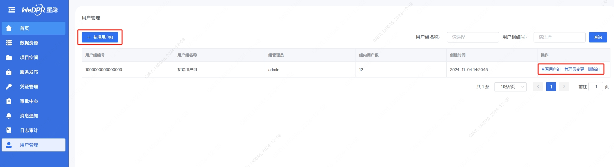
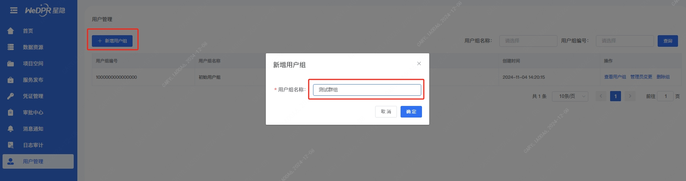
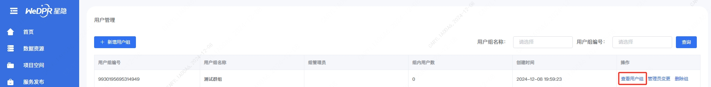
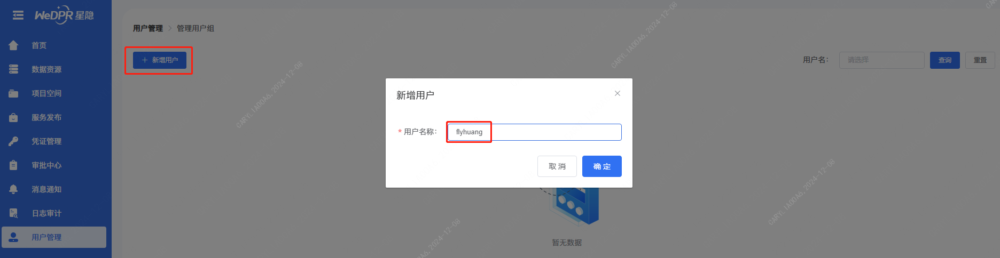
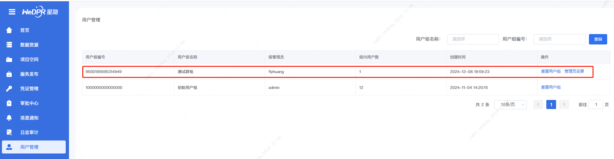
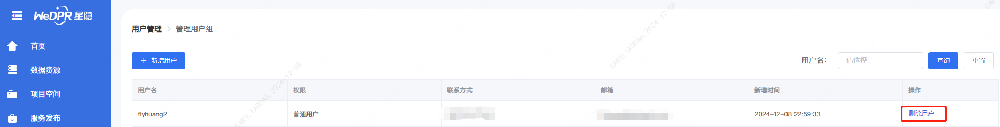

# 8. 用户管理

## 用户角色

平台有两种用户角色：
- **管理员：** 拥有创建用户组、删除用户组、查询用户组，查询用户，添加用户和变更用户组管理员
- **普通用户：** 无用户管理权限
- **用户组管理员：** 用户组内角色，由管理员或普通用户承担，可以管理所在用户组用户，如添加用户，移除用户，变更用户组管理员。

服务搭建成功后，可使用网页浏览器访问平台页面。平台管理员用户为`admin`，默认密码为`Admin123!`（登录后可以更改密码）。

普通用户可以通过注册功能进行注册新用户。
其中管理员用户可以创建、删除、变更用户组管理员功能。普通用户可以担任某个用户组的管理员。

### 管理员创建用户组
系统默认生成了一个初始用户组，所有新用户注册后默认都在初始化用户组，后续可以加入其他用户组。管理员可以创建新的用户组，并指定用户组中的成员为用户组管理员。

### 管理员添加用户
点击查看用户，然后添加机构内注册的用户

### 用户组删除用户
使用用户组管理员登录，可以查看所管理的用户组，并且可以添加用户，移除用户，变更用户组管理

其他操作，欢迎点击相应按钮进行试用。
