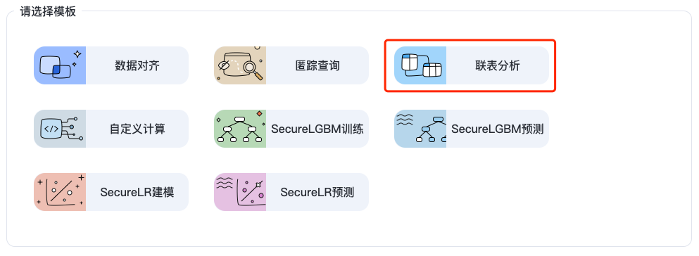
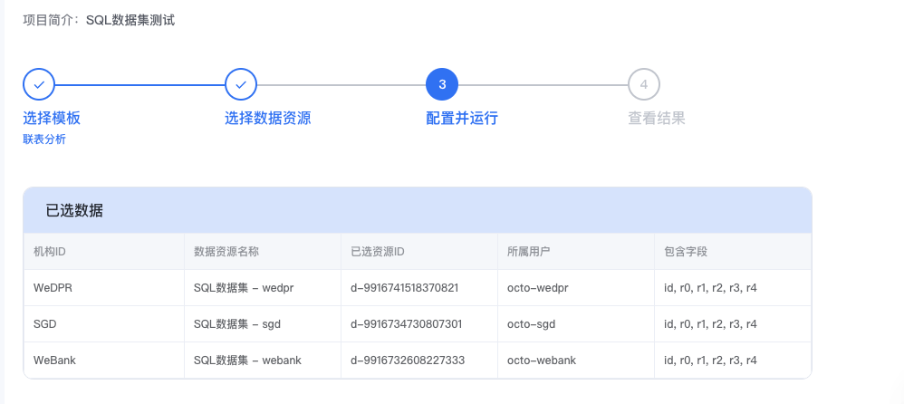
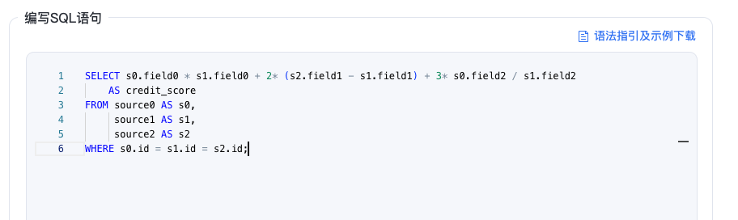
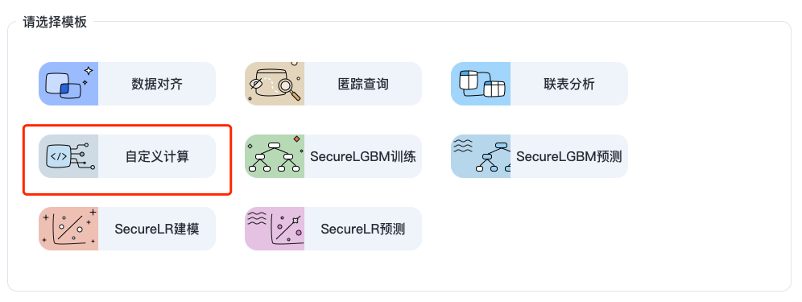
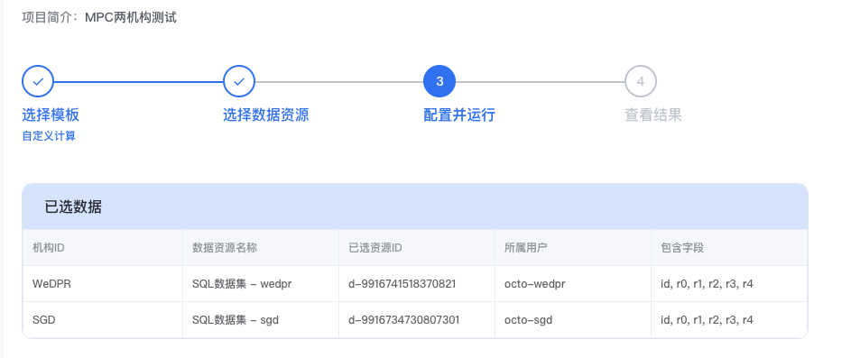
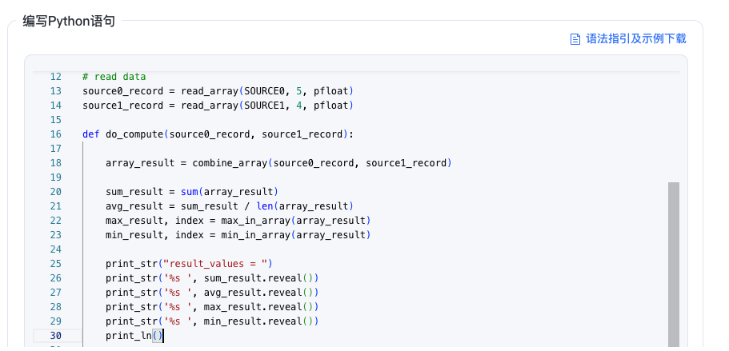

# 4. 隐私计算任务操作指引(向导模式)

标签: ``向导模式`` ``操作指南``

----

WeDPR中，用户参考[项目空间](./project_op.md)创建项目后，可在项目空间内发起各种类型的隐私计算任务，目前平台支持的隐私计算任务如下:


如下，项目空间内，可新建任务、查询任务、终止任务、复制任务，对于建模类的任务还可调参重跑。


## 4.1 新建任务

由于任务须归属于某个项目，因此发起所有类型任务之前，首先需要选定一个项目，操作步骤如下：

- 用户登录WeDPR管理平台，单击左侧导航栏中的【项目空间】进入到项目列表页面；
- 选择需要发起任务的项目卡片，单击进入【项目详情】页面
- 单击右上角的【新建任务】按钮可发起任务


### 4.1.1 数据对齐任务

```eval_rst
.. note::
   - 数据对齐仅支持对不同机构的数据集进行隐私求交集，同一机构的多个数据集无法进行运行PSI
   - 数据对齐任务中，须包含己方机构的数据集，不可全部选择他方机构数据集运行PSI任务
```

**使用前提**
****
- 已申请需要联合求交集的数据集使用权限，申请步骤可参考[数据集操作指引](dataset_op.md)中的**申请数据集权限**。

**操作步骤**
****
- 单击【项目详情】页面右上角的【新建任务按钮】，进入到【新增任务页面】，开始选择任务模板

- 选择【数据对齐】任务模板，单击【下一步】进入到【选择数据资源】页面

- 单击【选择参与方数据1】标签页，弹出【选择参与方】对话框，从中选择本机构的数据集，单击右下角的【确定】按钮，回到【选择数据资源】页面

- 单击【选择参与方数据2】标签，同样弹出【选择参与方】对话框，从中其他机构数据集

- WeDPR隐私计算平台支持>=2个参与方的隐私求交集任务，若还需要添加第三个甚至第四个机构的数据集，可单击【增加参与方】按钮继续新增参与PSI任务的数据集

- 数据资源选择完毕后，单击【下一步】进入到【配置并运行】页面，在该页面的【选择数据字段】对话框的【包含字段】列选择用于参与隐私求交集任务的数据列名

- 在【配置并运行】页面的【结果接收方】选项框中选择需要接收隐私求交集的结果的机构名称，单击【运行】发起数据对齐任务


### 4.1.2 匿踪查询任务

**使用前提**
****
- 拥有至少一个匿踪查询服务的使用权限，匿踪查询服务发布、权限申请可参考[这里](./service_publish_op.md)


**操作步骤**
****
- 单击【项目详情】页面右上角的【新建任务按钮】，进入到【新增任务页面】，选择【匿踪查询】任务模板:


- 单击【下一步】进入到【选择数据】页面，从已经发布成功的服务中选择需要查询的服务：


- 单击【下一步】进入到【配置并运行页面】，配置PIR任务，配置的参数主要包括：

| **参数名称** | **参数说明**                     |
|:---------|:-----------------------------|
| 查询类型     | 包括查询存在性和查询字段值两类              |
| 查询字段     | 选择【查询字段值】时，选择需要查询的字段列表       |
| 字段值      | 需要查询的记录主键值，一般是姓名、身份证号、社会信用号等 |

配置示例如下:


- 单击【运行】发起匿踪查询服务，匿踪查询服务详情如下：


pir任务结果记录于csv文件中，任务执行完毕后，可通过【任务信息】中的【任务结果】->【结果文件】下载匿踪查询结果，如下：


### 4.1.3 联表分析任务

**使用前提**
****
- 已申请需要联表分析任务的数据集使用权限，申请步骤可参考[数据集操作指引](dataset_op.md)中的**申请数据集权限**。

**操作步骤**
****
- 单击【项目详情】页面右上角的【新建任务按钮】，进入到【新增任务页面】，开始选择任务模板

- 选择【联表分析】任务模板，单击【下一步】进入到【选择数据资源】页面

- 单击【选择参与方数据1】标签页，弹出【选择参与方】对话框，从中选择本机构的数据集，单击右下角的【确定】按钮，回到【选择数据资源】页面

- 单击【增加参与方】标签，同样弹出【选择参与方】对话框，选择其他机构数据集

- WeDPR隐私计算平台支持两方或者三方的联表分析任务，若还需要添加第三个的数据集，可单击【增加参与方】按钮继续新增参与任务的数据集

- 数据资源选择完毕后，单击【下一步】进入到【编写SQL语句】页面，在该页面点击【语法指引及示例下载】可以下载SQL语法指引以及示例

- SQL编写完毕之后，单击【运行】发起联表分析任务
- 任务成功之后可以在任务详情看到结果文件【result.csv】






### 4.1.4 自定义计算任务


**使用前提**
****
- 已申请需要联表分析任务的数据集使用权限，申请步骤可参考[数据集操作指引](dataset_op.md)中的**申请数据集权限**。

**操作步骤**
****
- 单击【项目详情】页面右上角的【新建任务按钮】，进入到【新增任务页面】，开始选择任务模板

- 选择【自定义计算】任务模板，单击【下一步】进入到【选择数据资源】页面

- 单击【选择参与方数据1】标签页，弹出【选择参与方】对话框，从中选择本机构的数据集，单击右下角的【确定】按钮，回到【选择数据资源】页面

- 单击【增加参与方】标签，同样弹出【选择参与方】对话框，从中选择其他机构数据集

- WeDPR隐私计算平台支持两方或者三方的自定义计算任务，若还需要添加第三个的数据集，可单击【增加参与方】按钮继续新增参与任务的数据集

- 数据资源选择完毕后，单击【下一步】进入到【编写Python语句】页面，在该页面点击【语法指引及示例下载】可以下载Python语法指引以及示例

- Python编写完毕之后，单击【运行】发起自定义计算任务
- 任务成功之后可以在任务详情看到结果文件【result.csv】






### 4.1.5 SecureLGBM训练任务

**使用前提**
****
- 已申请需要联合建模的数据集使用权限，申请步骤可参考[数据集操作指引](dataset_op.md)中的**申请数据集权限**。
- 参与SecureLGBM训练任务的数据集须是合法的数据集，不能包含除了`nan`之外的非法字符
- 至少有一个数据集有标签`y`


**操作步骤**
****
- 单击【项目详情】页面右上角的【新建任务按钮】，进入到【新增任务页面】，选择【SecureLGBM训练】任务模板
- 单击【下一步】进入到【选择数据资源】页面，单击选择标签数据和参与方数据，如下:


- 选择参与建模的数据集后，单击[下一步]进入到【配置并运行】页面，设置建模参数，SecureLGBM支持的建模参数包括：

| **参数名称**                | **参数说明**                                                                       | **默认值** |
|:------------------------|:-------------------------------------------------------------------------------|:--------|
| use_psi                 | 是否基于双方数据的id字段求交集后再运行训练任务                                                       | false   |
| fillna                  | 是否进行缺失值填充(若数据集中含有缺失值，需设置该选项为true)                                              | false   |
| na_select               | 缺失值筛选阈值,取值范围为0~1之间(0表示只要有缺失值就移除,1表示移除全为缺失值的列)                                  | 1       |
| normalized              | 是否对数据集进行归一化处理                                                                  | false   |
| standardized            | 是否对数据集进行标准化处理                                                                  | false   |
| categorical             | 标记所有分类特征字段,格式:x1,x12(空代表无分类特征)                                                 | 空       |
| psi_select_col          | PSI稳定性筛选时间列名(空代表不进行PSI筛选)                                                      | 空       |
| psi_select_base         | PSI稳定性筛选的基期(空代表不进行PSI筛选)                                                       | 空       |
| psi_select_thresh       | PSI筛选阈值,取值范围为0~1之间                                                             | 0.3     |
| psi_select_bins         | 计算PSI时分箱数,取值范围为3~100之间                                                         | 4       |
| corr_select             | 特征相关性筛选阈值,取值范围为0~1之间(值为0时不进行相关性筛选)                                             | 0       |
| use_iv                  | 是否跑特征工程，联合计算iv值，并基于iv阈值进行特征筛选                                                  | false   |
| group_num               | woe计算分箱数,取值范围为3~100之间的整数                                                       | 4       |
| iv_thresh               | iv特征筛选的阈值,取值范围为0.01~1之间                                                        | 0.1     |
| use_goss                | 是否使用goss                                                                       | false   |
| test_dataset_percentage | 测试集比例, 取值范围为0.1~0.5之间                                                          | 0.3     |
| learning_rate           | 学习率, 取值范围为0.01~1之间                                                             | 0.1     |
| num_trees               | SecurLGBM迭代树棵树, 取值范围为1~300之间的整数                                                | 6       |
| max_depth               | SecureLGBM树深度, 取值范围为1~6之间的整数                                                   | 3       |
| max_bin                 | 特征分箱数, 取值范围为3~100之间的整数                                                         | 4       |
| silent                  | 是否打印详细日志                                                                       | false   |
| subsample               | 训练每棵树使用的样本比例,取值范围为0.1~1之间                                                      | 1       |
| colsample_bytree        | 训练每棵树使用的特征比例,取值范围为0.1~1之间                                                      | 1       |
| colsample_bylevel       | 训练每一层使用的特征比例,取值范围为0.1~1之间                                                      | 1       |
| reg_alpha               | L1正则化项,用于控制模型复杂度,取值范围为大于等于0的数值                                                 | 0       |
| reg_lambda              | L2正则化项,用于控制模型复杂度,取值范围为大于等于0的数值                                                 | 1       |
| gamma                   | 最优分割点所需的最小损失函数下降值,取值范围为大于等于0的数值                                                | 0       |
| min_child_weight        | 最优分割点所需的最小叶子节点权重,取值范围为大于等于0的数值                                                 | 0       |
| min_child_samples       | 最优分割点所需的最小叶子节点样本数量,取值范围为1~1000之间的整数                                            | 10      |
| seed                    | 分割训练集测试集时随机数种子,取值范围为0~10000之间的整数                                               | 2024    |
| early_stopping_rounds   | 指定迭代多少次没有提升则停止训练, 值为0时不执行, 取值范围为0~100之间的整数                                     | 0       |
| eval_metric             | 早停的评估指标,支持auc, acc, recall, precision                                          | auc     |
| verbose_eval            | 按传入的间隔输出训练过程中的评估信息,0表示不打印                                                      | 1       |
| eval_set_column         | 指定训练集测试集标记字段名称                                                                 | 空       |
| train_set_value         | 指定训练集标记值                                                                       | 空       |
| eval_set_value          | 指定测试集标记值                                                                       | 空       |
| train_features          | 指定入模特征                                                                         | 空       |

配置示例如下:


- 单击【运行】按钮发起SecureLGBM训练任务，任务元信息如下:


SecureLGBM任务执行结束后，可通过【任务详情】按钮查看可视化的训练结果。

- SecurLGBM任务执行完毕后，在【项目空间】->【项目详情】->【任务详情】页面会展示模型信息，可通过【保存模型】按钮将建模结果保存为模型；通过【保存配置】按钮保存训练配置；也可通过【调参重跑】按钮调整参数用同样的数据集再次发起训练任务。


### 4.1.6 SecureLGBM预测任务

**使用前提**
******

- 已申请需要联合建模的数据集使用权限，申请步骤可参考[数据集操作指引](dataset_op.md)中的**申请数据集权限**。
- 参与SecureLGBM训练任务的数据集须是合法的数据集，不能包含除了`nan`之外的非法字符
- 须拥有至少一个SecureLGBM模型

```eval_rst
.. note::
   - SecureLGBM训练任务可产生模型，具体操作流程可参考【4.1.5 SecureLGBM训练任务】
```


**操作步骤**
******

- 单击【项目详情】页面右上角的【新建任务按钮】，进入到【新增任务页面】，选择【SecureLGBM预测】任务模板
- 单击【下一步】进入到【选择数据资源】页面，按照提示【选择模型】：


- 在【选择数据资源】页面，按照提示【选择数据集】：

  

- 单击【下一步】进入到【配置并运行】任务页面，配置参数，并选择结果接收方，单击【运行】发起预测任务：

  

- 可通过【项目空间】-> 【项目详情】->【任务详情】页面查看预测任务的运行情况


### 4.1.7 SecureLR建模任务

SecureLR建模任务和SecureLGBM训练任务的使用前提、发起流程类似，仅在算法参数上有所差异，具体使用指南可参考[SecureLGBM训练任务](./wizard_mode_op.html#securelgbm)。

其算法参数介绍如下：

| **参数名称**                | **参数说明**                                                           | **默认值** |
|:------------------------|:-------------------------------------------------------------------|:--------|
| use_psi                 | 是否基于双方数据的id字段求交集后再运行训练任务                                           | false   |
| fillna                  | 是否进行缺失值填充(若数据集中含有缺失值，需设置该选项为true)                                  | false   |
| na_select               | 缺失值筛选阈值,取值范围为0~1之间(0表示只要有缺失值就移除,1表示移除全为缺失值的列)                      | 1       |
| normalized              | 是否对数据集进行归一化处理                                                      | false   |
| standardized            | 是否对数据集进行标准化处理                                                      | false   |
| categorical             | 标记所有分类特征字段,格式:x1,x12(空代表无分类特征)                                     | 空       |
| psi_select_col          | PSI稳定性筛选时间列名(空代表不进行PSI筛选)                                          | 空       |
| psi_select_base         | PSI稳定性筛选的基期(空代表不进行PSI筛选)                                           | 空       |
| psi_select_thresh       | PSI筛选阈值,取值范围为0~1之间                                                 | 0.3     |
| psi_select_bins         | 计算PSI时分箱数,取值范围为3~100之间                                             | 4       |
| corr_select             | 特征相关性筛选阈值,取值范围为0~1之间(值为0时不进行相关性筛选)                                 | 0       |
| use_iv                  | 是否跑特征工程，联合计算iv值，并基于iv阈值进行特征筛选                                      | false   |
| group_num               | woe计算分箱数,取值范围为3~100之间的整数                                           | 4       |
| iv_thresh               | iv特征筛选的阈值,取值范围为0.01~1之间                                            | 0.1     |
| use_goss                | 是否使用goss                                                           | false   |
| test_dataset_percentage | 测试集比例, 取值范围为0.1~0.5之间                                              | 0.3     |
| learning_rate           | 学习率, 取值范围为0.01~1之间                                                 | 0.1     |
| epochs                  | 数据迭代轮数                                                             | 3       |
| batch_size              | 每次训练迭代中使用的数据量                                                      | 16      |
| silent                  | 是否打印详细日志                                                           | false   |
| seed                    | 分割训练集测试集时随机数种子,取值范围为0~10000之间的整数                                   | 2024    |
| verbose_eval            | 按传入的间隔输出训练过程中的评估信息,0表示不打印                                          | 1       |
| eval_set_column         | 指定训练集测试集标记字段名称                                                     | 空       |
| train_set_value         | 指定训练集标记值                                                           | 空       |
| eval_set_value          | 指定测试集标记值                                                           | 空       |
| train_features          | 指定入模特征                                                             | 空       |


### 4.1.8 SecureLR预测任务

SecureLR预测任务和SecureLGBM预测任务的使用前提、发起流程类似，具体使用指南可参考[SecureLGBM预测任务](./wizard_mode_op.html#id7)。

## 4.2 查询任务

**按条件查询任务**
*****

- 单击【项目空间】，单击选中需要查询的项目，进入到【项目详情】页面
- 在项目详情页面可通过如下参数筛选任务：

  | **参数名称**               | **参数说明**                                                                                       |
  |:-----------------------|:-----------------------------------------------------------------------------------------------|
  | 任务模板                   | 任务类型，包括：<br>数据对齐、匿踪查询、联表分析、自定义计算、SecureLGBM训练、SecureLGBM预测<br>SecureLR建模、SecureLR预测、数据预处理、特征工程 |
  | 任务ID                   | 根据任务ID筛选任务                                                                                     |
  | 任务状态                   | 根据任务状态筛选任务                                                                                     | 
  | 创建时间                   | 根据创建时间筛选任务                                                                                     |


**查看任务详情**
*****

- 单击【项目空间】，单击选中需查询的项目，进入到【项目详情】页面
- 单击【查看详情】进入到【任务详情】页面可查看【任务信息】、【运行日志】、【任务结果】

## 4.3 任务相关操作

为了方便用户操作，WeDPR支持终止任务、复制任务、任务调参重跑，这些操作按钮均位于【项目空间】->【项目详情】页面，可直接单击操作按钮进行相关操作。

