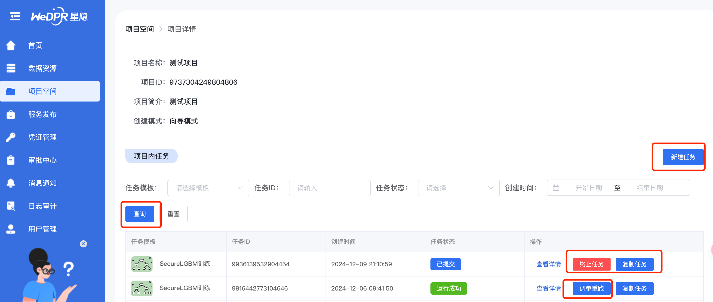
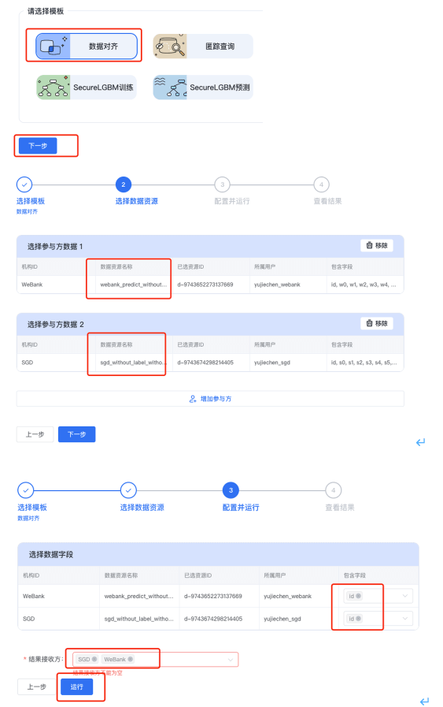

# 4. 隐私计算任务操作指引(向导模式)

标签: ``向导模式`` ``操作指南``

----

WeDPR中，用户参考[项目空间](./project_op.md)创建项目后，可在项目空间内发起各种类型的隐私计算任务，目前平台支持的隐私计算任务如下:


如下，项目空间内，可新建任务、查询任务、终止任务、复制任务，对于建模类的任务还可调参重跑。



## 4.1 新建任务

由于任务须归属于某个项目，因此发起所有类型任务之前，首先需要选定一个项目，操作步骤如下：

- 用户登录WeDPR管理平台，单击左侧导航栏中的【项目空间】进入到项目列表页面；
- 选择需要发起任务的项目卡片，单击进入【项目详情】页面
- 单击右上角的【新建任务】按钮可发起任务

### 4.1.1 数据对齐任务

```eval_rst
.. note::
   - 数据对齐仅支持对不同机构的数据集进行隐私求交集，同一机构的多个数据集无法进行运行PSI
   - 数据对齐任务中，须包含己方机构的数据集，不可全部选择他方机构数据集运行PSI任务
```

**使用前提**
****
- 已申请需要联合求交集的数据集使用权限，申请步骤可参考[数据集操作指引](dataset_op.md)中的**申请数据集权限**。

**操作步骤**
****
- 单击【项目详情】页面右上角的【新建任务按钮】，进入到【新增任务页面】，开始选择任务模板
- 选择【数据对齐】任务模板，单击【下一步】进入到【选择数据源页面】
- 单击【选择参与方数据1】标签页，弹出【选择参与方】对话框，从中选择本机构的数据集，单击右下角的【确定】按钮，回到【选择数据资源】页面
- 单击【选择参与方数据2】标签，同样弹出【选择参与方】对话框，从中其他机构数据集
- WeDPR隐私计算平台支持>=2个参与方的隐私求交集任务，若还需要添加第三个甚至第四个机构的数据集，可单击【增加参与方】按钮继续新增参与PSI任务的数据集
- 数据资源选择完毕后，单击【下一步】进入到【配置并运行】页面，在该页面的【选择数据字段】对话框的【包含字段】列选择用于参与隐私求交集任务的数据列名
- 在【配置并运行】页面的【结果接收方】选项框中选择需要接收隐私求交集的结果的机构名称，单击【运行】发起数据对齐任务




### 4.1.2 匿踪查询任务

**使用前提**
****
- 持有至少一个匿踪查询服务的使用权限，匿踪查询服务发布、权限申请可参考[这里](./service_publish_op.md)


**操作步骤**
****

### 4.1.3 联表分析任务

### 4.1.4 自定义计算任务

### 4.1.5 SecureLGBM训练任务

### 4.1.6 SecureLGBM训练任务

### 4.1.7 SecureLR建模任务


### 4.1.8 SecureLR预测任务

## 4.2 查询任务

## 4.3 任务相关操作
